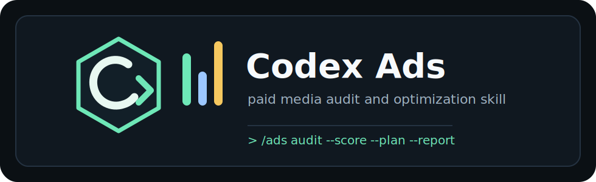

<p align="center">
  
</p>

# Codex Ads

Codex Ads is a local Codex skill bundle for paid advertising audits, optimization plans, creative review, attribution checks, PPC math, and client-ready reports.

It helps marketers and operators inspect Google, Meta, YouTube, LinkedIn, TikTok, Microsoft, Apple, and Amazon Ads using structured checklists, scoring rules, platform benchmarks, and practical next actions.

[中文说明](README.md) · [Quick Start](QUICKSTART.en.md)

## What It Does

- Runs multi-platform ad account audits with a weighted Ads Health Score.
- Reviews Google, Meta, YouTube, LinkedIn, TikTok, Microsoft, Apple, and Amazon Ads.
- Checks tracking, attribution, conversion setup, budget sufficiency, bidding strategy, creative fatigue, compliance, and landing-page quality.
- Helps agency operators work inside fixed client constraints when KPI, product positioning, pricing, or payment flow cannot be changed, especially install-heavy/pay-light, lead-heavy/low-quality, and low-CPI/poor-ROI accounts.
- Handles repetitive agency operations: daily patrols, anomaly triage, client replies, creative request briefs, report cleanup, changelogs, and weekly/monthly summaries.
- Generates strategic plans by business type, including SaaS, e-commerce, local service, B2B, finance, healthcare, mobile apps, and agencies.
- Produces campaign briefs, copy directions, creative prompts, PPC calculations, A/B test plans, and PDF audit reports.
- Defaults to Computer Use-assisted read-only dashboard inspection when the user is logged into an ad platform; it does not edit budgets, pause campaigns, or apply recommendations unless explicitly confirmed.
- Guides users through safe read-only access before inspecting live dashboards, and keeps reusable docs free of client-specific account details.

## Install

Install for Codex:

```bash
bash install.sh
```

Install to a custom location:

```bash
bash install.sh --target=codex --skill-dir=~/custom/skills --agent-dir=~/custom/agents
```

Windows PowerShell:

```powershell
.\install.ps1
```

The default install paths are:

| Type | Path |
| --- | --- |
| Skills | `~/.codex/skills` |
| Agents | `~/.codex/agents` |
| Main skill | `~/.codex/skills/ads` |

## Quick Start

You do not need to memorize slash commands. Start Codex and paste a natural-language request:

```text
Review this ad account in read-only mode. Check budget pacing, conversion quality, goal setup, and next optimization actions. Do not change any settings.
```

See [Quick Start](QUICKSTART.en.md) for copy-paste prompts.

Codex Ads asks for business context before deep analysis: industry, monthly spend, primary goal, and active platforms. That context keeps benchmarks and priorities realistic.

## Optimizer Customization

Each optimizer can keep their own rules in `CODEX_ADS_OPTIMIZER.md`. Codex Ads reads it before analysis and uses the optimizer's judgment style, scaling rules, pause rules, creative preferences, and client reporting tone.

Example:

```text
Create a CODEX_ADS_OPTIMIZER.md file for my optimization style. My style is: check conversion goals first, then budget pacing, then geo and creative. Client updates should be direct but not overly aggressive.
```

## Commands

| Command | Purpose |
| --- | --- |
| `/ads audit` | Full multi-platform audit |
| `/ads google` | Google Ads analysis |
| `/ads meta` | Meta Ads analysis |
| `/ads youtube` | YouTube Ads analysis |
| `/ads linkedin` | LinkedIn Ads analysis |
| `/ads tiktok` | TikTok Ads analysis |
| `/ads microsoft` | Microsoft Ads analysis |
| `/ads apple` | Apple Ads analysis |
| `/ads amazon` | Amazon Ads analysis |
| `/ads attribution` | Cross-platform attribution review |
| `/ads tracking` | Server-side tracking review |
| `/ads creative` | Creative quality and fatigue review |
| `/ads landing` | Landing-page conversion review |
| `/ads budget` | Budget allocation and bidding review |
| `/ads levers` | Agency constrained-scenario diagnosis |
| `/ads patrol` | Daily account patrol |
| `/ads anomaly` | Sudden metric-change triage |
| `/ads client-reply` | Client-safe explanations |
| `/ads creative-request` | Creative/design/video request briefs |
| `/ads clean-report` | Cleanup exported reports and normalize metrics |
| `/ads adapt-template` | Adapt arbitrary client report templates with field mapping |
| `/ads changelog` | Optimization change log |
| `/ads meeting` | Weekly/monthly meeting summary |
| `/ads plan <type>` | Strategic plan by business type |
| `/ads competitor` | Competitor ad research |
| `/ads math` | PPC calculator |
| `/ads test` | A/B test design |
| `/ads report` | PDF report generation |
| `/ads daily` | Guided daily performance report |
| `/ads creative-weekly` | Guided weekly creative performance report |
| `/ads dna <url>` | Brand DNA extraction |
| `/ads create` | Campaign concepts and copy briefs |
| `/ads generate` | AI ad image generation |
| `/ads photoshoot` | Product photography prompts |

## Repository Layout

```text
ads/                 Main skill and reference files
skills/              Platform and workflow sub-skills
agents/              Audit and creative agents
scripts/             Optional local Python utilities
tests/               Pytest coverage
evals/               Creative evaluation fixtures
.codex-plugin/       Codex plugin metadata
```

## Local Utilities

Some commands use Python helpers from `scripts/`. Install dependencies with:

```bash
pip3 install -r requirements.txt
```

Image generation is configured with `ADS_IMAGE_PROVIDER` and the matching provider key, such as `GOOGLE_API_KEY` or `OPENAI_API_KEY`.

## Test

```bash
pip3 install -r requirements-dev.txt
pytest -q
```

## Uninstall

```bash
bash uninstall.sh
```

Windows:

```powershell
.\uninstall.ps1
```

## License

MIT. See [LICENSE](LICENSE).
